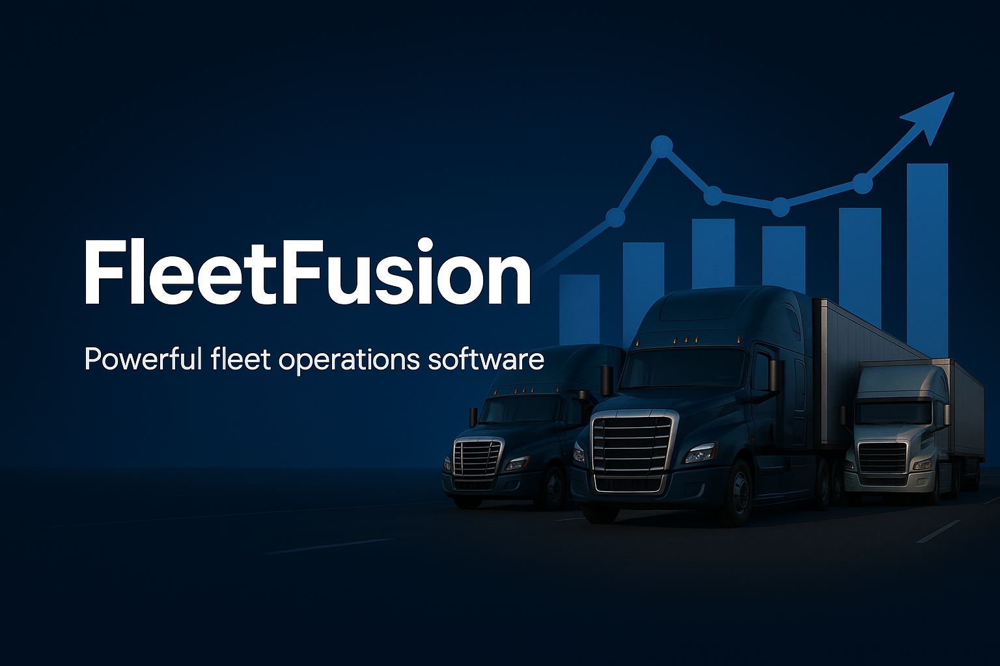

<!-- FleetFusion SaaS Platform -->

<p align="center">
  
</p>

<h1 align="center">FleetFusion 🚚✨</h1>

<p align="center">
  <b>Modern, Multi-Tenant SaaS for Fleet Management</b><br/>
  <a href="https://fleet-fusion.vercel.app">Live Demo</a> • <a href="#features">Features</a> • <a href="#tech-stack">Tech Stack</a> • <a href="#getting-started">Getting Started</a>
</p>

<p align="center">
  <a href="https://vercel.com/digital-herencia/fleet-fusion"></a>
  
  
  
</p>

---

> **FleetFusion** is a next-gen SaaS platform for trucking companies to manage vehicles, drivers,
> loads, compliance, and analytics. Built with the latest Next.js, React Server Components, Prisma
> ORM, and Neon Postgres. 🚀

---

## ✨ Features

-   **🚦 Dispatch Board:** Drag-and-drop load assignment, real-time status, and notifications
-   **🚚 Vehicle Management:** Maintenance, inspections, compliance docs, and analytics
-   **🧑‍✈️ Driver Management:** Licensing, HOS, performance, and alerts
-   **🛡️ Compliance:** Central dashboard, document uploads, and automated reminders
-   **⛽ IFTA Reporting:** Automated miles/fuel, tax calculation, and export
-   **📊 Analytics:** Real-time dashboards for performance, utilization, and finance
-   **🔐 Role-Based Access:** Admin, Dispatcher, Driver, Compliance, Account Manager
-   **🏢 Multi-Tenancy:** Company-level data isolation and org-based access
-   **🌗 Modern UI:** Responsive, accessible, dark/light mode, mobile-friendly

---

## 🛠️ Tech Stack

-   **Frontend:** Next.js 15 (App Router), React 19 (Server Components), Tailwind CSS 4
-   **Backend:** Node.js/Edge, React Server Actions, Next.js API Routes
-   **Database:** PostgreSQL (Neon), Prisma ORM
-   **Auth:** Clerk (org-based, RBAC)
-   **Storage:** Vercel Blob Storage
-   **Monitoring:** Vercel Analytics
-   **Testing:** Vitest, React Testing Library, Playwright
-   **Coverage:** Codecov reports via GitHub Actions

---

## 🚀 Getting Started

### Prerequisites

-   Node.js 18+
-   npm 9+
-   Neon.tech Postgres or compatible
-   Clerk account

### Quickstart

```bash
git clone https://github.com/your-username/fleet-fusion.git
cd fleet-fusion
npm install
cp .env.example .env.local # Edit with your DATABASE_URL and DIRECT_URL
npm run dev
```

Open [http://localhost:3000](http://localhost:3000)

### Running Tests

Install project dependencies before running tests:

```bash
npm install
npm test
```

### PDF Storage Provider

Generated PDF reports are uploaded via a configurable provider.
Set `STORAGE_PROVIDER` to `filesystem` (default) or `s3`.
For S3, also define `S3_BUCKET`, `S3_REGION`, `S3_PUBLIC_URL`,
`AWS_ACCESS_KEY_ID`, and `AWS_SECRET_ACCESS_KEY`.
Local storage writes to the path defined in `config/pdf.ts`.

## Feature Flags
FleetFusion supports runtime toggles via environment variables. See [docs/feature-flags.md](./docs/feature-flags.md) for details.

---

## 🆘 Help & Support

-   **Docs:** See the `/docs` folder for user guides and technical docs
-   [FleetFusion Docs](./docs/Developer-Documentation.md)

---

## Development Workflow

-   **Branch Names**: `feature/xyz`, `fix/abc`, `docs/doc-change`
-   **PR Titles**: `[type]: short description` (e.g., `feat: add driver dashboard`)
-   **Project Board**: All issues/PRs are tracked on the
    [Project Board](https://github.com/users/DigitalHerencia/projects/4).
-   **Milestones**: Features are grouped by release milestones (e.g., Q3 2025).
-   **Merge Conflicts**: See our [Merge Conflict Resolution Guide](./docs/merge-conflict-resolution.md) for step-by-step help.

See [CONTRIBUTING.md](./CONTRIBUTING.md) for full guidelines.

### Linting & Formatting

Run `npm run lint` to check code quality. Use `npm run format` to automatically format the project with Prettier.

---

## 📝 License

MIT License. See [LICENSE](LICENSE) for details.

---

<p align="center">
  <b>FleetFusion – The Future of Fleet Management SaaS 🚚✨</b>
</p>

<!-- End of README -->
