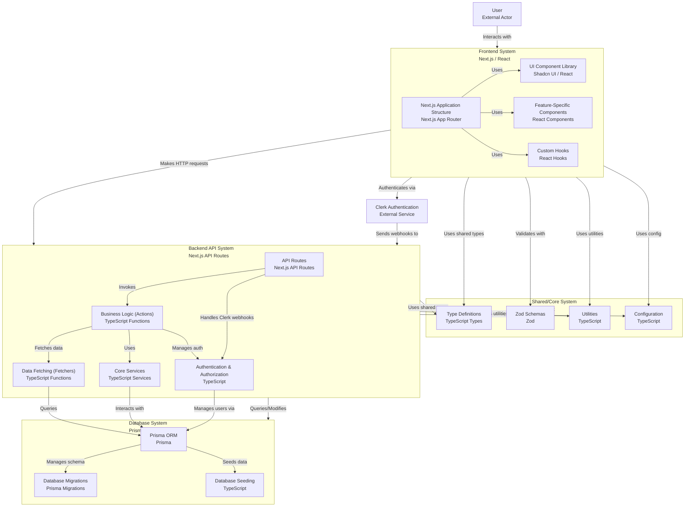

```mermaid
graph TD

    11["User<br>External Actor"]
    12["Clerk Authentication<br>External Service"]
    subgraph 1["Shared/Core System<br>TypeScript"]
        41["Type Definitions<br>TypeScript Types"]
        42["Zod Schemas<br>Zod"]
        43["Utilities<br>TypeScript"]
        44["Configuration<br>TypeScript"]
    end
    subgraph 2["Database System<br>Prisma ORM"]
        38["Prisma ORM<br>Prisma"]
        39["Database Migrations<br>Prisma Migrations"]
        40["Database Seeding<br>TypeScript"]
        %% Edges at this level (grouped by source)
        38["Prisma ORM<br>Prisma"] -->|Manages schema| 39["Database Migrations<br>Prisma Migrations"]
        38["Prisma ORM<br>Prisma"] -->|Seeds data| 40["Database Seeding<br>TypeScript"]
    end
    subgraph 3["Backend API System<br>Next.js API Routes"]
        34["Business Logic (Actions)<br>TypeScript Functions"]
        35["Data Fetching (Fetchers)<br>TypeScript Functions"]
        36["Core Services<br>TypeScript Services"]
        37["Authentication &amp; Authorization<br>TypeScript"]
        4["API Routes<br>Next.js API Routes"]
        %% Edges at this level (grouped by source)
        4["API Routes<br>Next.js API Routes"] -->|Invokes| 34["Business Logic (Actions)<br>TypeScript Functions"]
        4["API Routes<br>Next.js API Routes"] -->|Handles Clerk webhooks| 37["Authentication &amp; Authorization<br>TypeScript"]
        34["Business Logic (Actions)<br>TypeScript Functions"] -->|Fetches data| 35["Data Fetching (Fetchers)<br>TypeScript Functions"]
        34["Business Logic (Actions)<br>TypeScript Functions"] -->|Uses| 36["Core Services<br>TypeScript Services"]
        34["Business Logic (Actions)<br>TypeScript Functions"] -->|Manages auth| 37["Authentication &amp; Authorization<br>TypeScript"]
    end
    subgraph 5["Frontend System<br>Next.js / React"]
        27["UI Component Library<br>Shadcn UI / React"]
        28["Feature-Specific Components<br>React Components"]
        29["Custom Hooks<br>React Hooks"]
        6["Next.js Application Structure<br>Next.js App Router"]
        %% Edges at this level (grouped by source)
        6["Next.js Application Structure<br>Next.js App Router"] -->|Uses| 27["UI Component Library<br>Shadcn UI / React"]
        6["Next.js Application Structure<br>Next.js App Router"] -->|Uses| 28["Feature-Specific Components<br>React Components"]
        6["Next.js Application Structure<br>Next.js App Router"] -->|Uses| 29["Custom Hooks<br>React Hooks"]
    end
    %% Edges at this level (grouped by source)
    3["Backend API System<br>Next.js API Routes"] -->|Queries/Modifies| 2["Database System<br>Prisma ORM"]
    3["Backend API System<br>Next.js API Routes"] -->|Uses shared types| 41["Type Definitions<br>TypeScript Types"]
    3["Backend API System<br>Next.js API Routes"] -->|Validates with| 42["Zod Schemas<br>Zod"]
    3["Backend API System<br>Next.js API Routes"] -->|Uses utilities| 43["Utilities<br>TypeScript"]
    3["Backend API System<br>Next.js API Routes"] -->|Uses config| 44["Configuration<br>TypeScript"]
    5["Frontend System<br>Next.js / React"] -->|Makes HTTP requests| 3["Backend API System<br>Next.js API Routes"]
    5["Frontend System<br>Next.js / React"] -->|Authenticates via| 12["Clerk Authentication<br>External Service"]
    5["Frontend System<br>Next.js / React"] -->|Uses shared types| 41["Type Definitions<br>TypeScript Types"]
    5["Frontend System<br>Next.js / React"] -->|Validates with| 42["Zod Schemas<br>Zod"]
    5["Frontend System<br>Next.js / React"] -->|Uses utilities| 43["Utilities<br>TypeScript"]
    5["Frontend System<br>Next.js / React"] -->|Uses config| 44["Configuration<br>TypeScript"]
    12["Clerk Authentication<br>External Service"] -->|Sends webhooks to| 3["Backend API System<br>Next.js API Routes"]
    11["User<br>External Actor"] -->|Interacts with| 5["Frontend System<br>Next.js / React"]
    35["Data Fetching (Fetchers)<br>TypeScript Functions"] -->|Queries| 38["Prisma ORM<br>Prisma"]
    36["Core Services<br>TypeScript Services"] -->|Interacts with| 38["Prisma ORM<br>Prisma"]
    37["Authentication &amp; Authorization<br>TypeScript"] -->|Manages users via| 38["Prisma ORM<br>Prisma"]
```